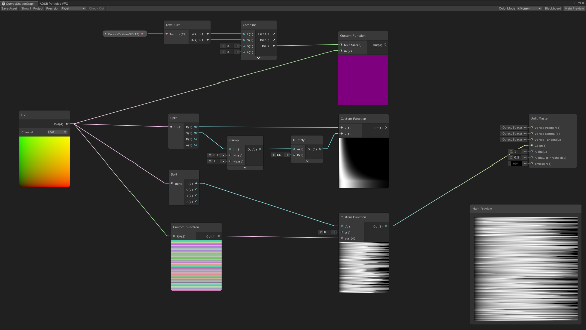
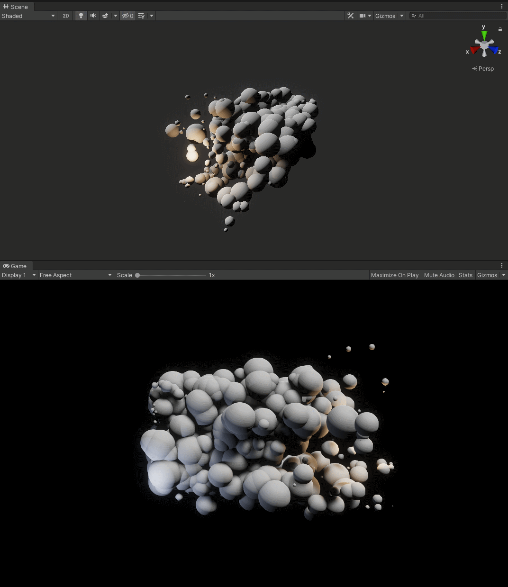

# unity-vfx-shadergraph-curves

An exercise to test the feasibility of using Unity Shader Graph (and custom function nodes) to generate per particle animation curves for Visual Effect Graph,
In this case, ADSR style envelopes (attack, decay, sustain, release.) A simple impulse example is included as well.
This started as a conversation with Carlos Garcia / L05 on the Unity discord.

This could be further simplified in forthcoming release of visual effect graph with support for arrays. Then a custom shader or Shader Graph may not be needed at all. I can think of a few other ways to approach this with futures in mind as well. Such as setting the ADSR float4 directly as an attribute for each particle, and procedurally look up the curve at runtime in the vfx graph compute context using the age attribute, which avoids generating a buffer at all. this would require some sort of custom function block and or operator which I believe is on the roadmap as well

If it's a workable solution to do the envelope lookup before / outside of vfx graph and just have the current attribute values like "current size" streamed into vfx graph on a smaller buffer.. instead of a buffer of envelopes that vfx graph has to sample per particle to determine the current value of based on particle age.

Currently The main thing I'm not happy with is that there is no built-in way yet to create a Shader Graph that renders directly into a Texture2D or Texture3D. So this examples uses an orthographic camera that is masked to only see a quad with the HDRP Unlit shader graph material applied to it. It would be much cleaner and more flexible (Texture3D, Texture2D array support) to have a Render Texture Shader Graph type available. In fact LG has shown this possible in a fork of HDRP they made for a robotics simulator a while back that can be found on github with a "Custom RenderTexture ShaderGraph," but I had limited success in porting it from HDRP 5.1 to 7.1 and decided against pursuing it further as it would actually be cleaner to start over fresh.

 

